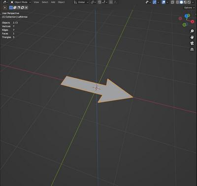

# Ambiguous Object Creator Add-on

## Introduction

The goal of this add-on is to create "ambiguous objects" like [the optical illusion created by SUGIHARA Kokichi](
http://www.isc.meiji.ac.jp/~kokichis/ambiguousc/ambiguouscylindere.html).
It creates a simple tube from 2 flat shapes representing the expected tube shape as seen from the two opposite sides.

The add-on is mainly targeting the creation of paper objects using the "Export Paper Model" add-on available in Blender (it needs to be activated in Blender preferences). It can be used to create a 3D-printable shape also, extruding and scaling the tube.

Have fun!

## Examples

### Circle/Diamond

First object

Second object

The ambiguous object

View from camera 1

View from camera 2

Papertoy

### Left/right Arrow

First object

Second object

The ambiguous object

View from camera 1

View from camera 2 (axis are reversed!)

Papertoy

## Installation

Download the [Ambiguous_object_creator.py](https://thierryscreations.pagesperso-orange.fr/AmbiguousObjectCreator/Ambiguous_object_creator.py) file and install the add-on using the blender preferences.

The [Ambiguous_object_creator.blend](https://thierryscreations.pagesperso-orange.fr/AmbiguousObjectCreator/Ambiguous_object_creator.blend) file contains predefined sample objects ready to be used for creating ambiguous objects and 2 cameras at the correct positions to view the optical illusion from both sides.

## Usage

Select 2 flat objects defining the shapes you want to see from either side and click the "Ambiguous object" in the "Object" menu of the 3D view to create the tube shape.

The *plane* option creates a flat surface inside the tube, necessary to ensure the paper tube has the correct shape when creating a papertoy. Uncheck it if you want to process the object for a 3D print.

## Details

The add-on checks some basic requirements:
- Two objects must be selected
- The objects must have only one face, flat on z=0 plane, centered at origin
- The face must cover the origin
So the source objects overlap before they are processed.

The script scales and moves the objects to ensure the same width on X axis (corresponding to the width of the tube that will be created).

The add-on works with convex and concave shapes. They don't need to have the same depth on Y axis.

The illusion or the add-on might not work very well with any shape... Also it may generate papertoys that are difficult to build. For the creation of a papertoy, it's recommended to use initial objects with a small number of edges. You need to try it by yourself.

The add-on doesn't take into account the exact perspective, but the illusion works well when a 5 cm diameter tube is placed at 50 cm distance for example.
